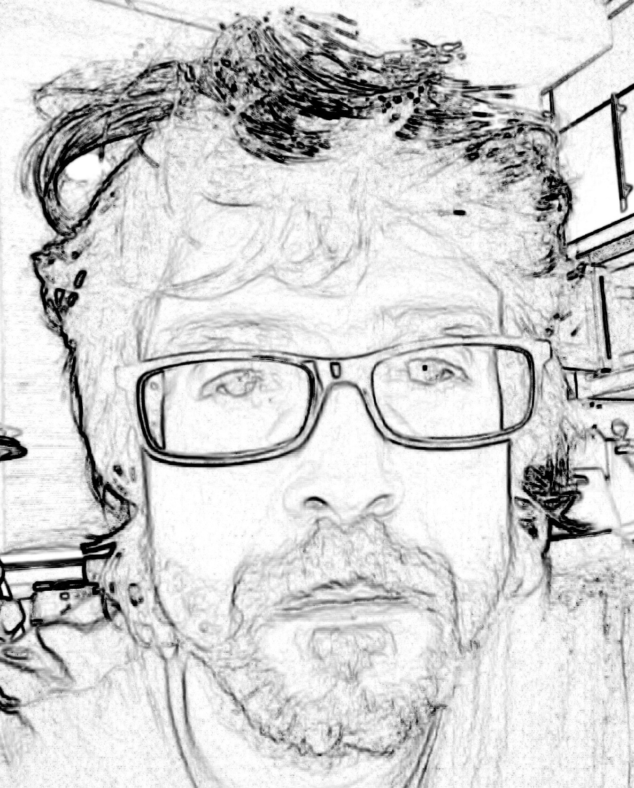

# Del SW libre a Cultura Libre 

::: incremental

- Eat spaghetti
- Drink wine

:::

:::  notes

This is my note.

- It can contain Markdown
- like this list

:::

A ver como lo pone fadsjkñlllllllllllllllllllllllllllllllllll  

dafsjñklasjdkfjñajsfdñas

jklañdsfjkñlasdjfñaslkjfñalksfd

jlñafdsjñasjfñasdjjñfladsjlk

afjdkasjñklfdñlajsdfjklasdj

# Presentación

Carlos Rodríguez Jaso
*Docente de profesión y aprendiz de vocación*
. . .

[https://github.com/crdguez](https://github.com/crdguez)

Esta presentación se encuentra disponible en 

# Algunas cuestiones

* ¿Alguien publica la documentación que genera?
* ¿Cuánta gente busca apuntes de otros por internet?
* ¿Cuántos saben qué es el SW libre y la cultura libre ?
* ¿Cuánta gente usa habitualmente SW libre?
* ¿Qué pasaría si los científicos no publicarán sus descubrimientos?

# Democratización del modelo científico

## cansat
## ciencia ciudadana