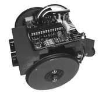
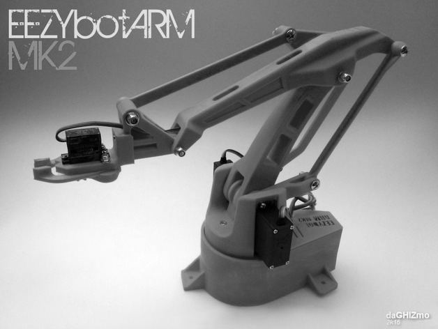

# Presentación

:::::::::::::: {.columns}
::: {.column width="70%"}

**Carlos Rodríguez Jaso** 

*Docente de profesión y aprendiz de vocación*

* [Github personal:]{.smallcaps} 
  [https://github.com/crdguez](https://github.com/crdguez)

* Esta presentación se encuentra disponible en:[https://crdguez.github.io/mis_presentaciones/cledu.html](https://crdguez.github.io/mis_presentaciones/cledu.html)

:::

::: {.column width="30%"}

::: 

::::::::::::::

# Algunas cuestiones previas

:::::::::::::: {.columns}
::: {.column width="40%"}
::: incremental

* ¿Alguien **publica** la documentación que genera?
* ¿Cuánta gente busca apuntes de otros por internet?
* ¿Cuántos saben qué es el **SW libre** y la cultura libre ?
* ¿Cuánta gente usa habitualmente SW libre?
* ¿Qué pasaría si los **científicos** no publicarán sus descubrimientos?
* ¿Y si los **docentes** no transmitieramos el conocimiento?

:::
:::
::: {.column width="60%"}

[https://goo.gl/forms/WPcut7UhJ3ZcIuox2](https://goo.gl/forms/WPcut7UhJ3ZcIuox2)

:::
::::::::::::::

::: notes

?????

:::

# Resultados, objetivo

:::::::::::::: {.columns}
::: {.column width="40%"}

[https://goo.gl/5srkMW](https://goo.gl/5srkMW)

:::
::: {.column width="60%"}

Me daré por satisfecho si al final de la presentación ...

::: incremental

* ...  comprendemos la **importancia de compartir el conocimiento que generemos**

:::

:::
::::::::::::::

::: notes

?????

:::

### 

# Un poco de historia

:::::::::::::: {.columns}
::: {.column width="40%"}

[Encyclopedie de D'Alembert et Diderot (fuente: Wikimedia Commons)](https://commons.wikimedia.org/wiki/File:Encyclopedie_de_D%27Alembert_et_Diderot_-_Premiere_Page_-_ENC_1-NA5.jpg)

:::
::: {.column width="60%"}

* Los intereses privados frente al bien común hacen que surjan en el s. XVIII los derechos de autor frente al dominio público. 

::: incremental

* Por otro lado aparecen ejemplos de democratizar o socializar el conocimiento:

  - La Ilustración y el s. XVIII:  la enciclopedia de Diderot y D`Alembert
  - Internet y la web 2.0
  - El movimiento del Software Libre y su ética

:::

:::
::::::::::::::

::: notes

La defensa de los derechos de autor es muy respetable aunque, es obvio que la ocultación de información no favorece el aprovechamiento del conocimiento.  La pérdida de libertad de acceso al conocimiento "frena" su desarrollo

El modelo científico se basa en la publicación del conocimiento.

Internet ha sido la tecnología que ha facilitado el boom de lo libre. Es la fuente de difusión de conocimiento actual

:::

# La ética del Movimiento del Software Libre

:::::::::::::: {.columns}
::: {.column width="40%"}

[Richard Stallman (fuente: Wikimedia Commons)](https://commons.wikimedia.org/wiki/File:Richard_Stallman_2016_Talk_in_Madrid_06.jpg)

:::
::: {.column width="60%"}

::: incremental

- Fundado por Richard Stallman, defiende el hecho de ganar en libertad al tener acceso "libre" al conocimiento (particularmente al código de los programas):
  - 1ª Libertad:  Libertad de uso
  - 2ª Libertad: Libertad de estudio
  - 3ª Libertad: Libertad de distribución
  - 4ª Libertad: Libertad de mejora
- Obligaciones: Vienen determinadas por las licencias, y si son libres, respetan las libertades anteriores. Más o menos restrictivas, pero al menos exigen la atribución
- Extensión a otros ámbitos culturales: Música, arte, hardware, etc. $\to$ **Cultura Libre**

:::

:::
::::::::::::::

::: notes

:::

# Algunos mitos y barreras del Software Libre

:::::::::::::: {.columns}
::: {.column width="40%"}

[Eugène Delacroix derivative work: Ju gatsu mikka (fuente:wikimedia)](https://commons.wikimedia.org/wiki/File:CC_guidant_les_contributeurs.jpg)

:::
::: {.column width="60%"}
* El software libre es gratis

* El software libre no me obliga a nada

* El SL es de "frikis" que solo usan SL

* Dificultades para "contribuir"

  - Comunidades cerradas
  - "Aún no tengo todo bien documentado"

  ​	

:::
::::::::::::::

::: notes

La Cultura Libre es solo una opción, lo no libre es también muy respetable

:::

# Beneficios de "compartir" el conocimiento

:::::::::::::: {.columns}
::: {.column width="70%"}

::: incremental

* Democratización del modelo que sigue la comunidad científica
* Tener que documentar nos ayuda a sintetizar, organizar y aprender en profundidad
* Ayudamos a otras personas a que aprendan
* Posibilitamos que otros mejoren lo que hemos hecho
* Transmitimos a nuestro alumnado un modelo de enseñanza-aprendizaje
* Generalmente "el conocimiento" se genera de manera más rápida 

:::

:::
::: {.column width="30%"}

[Primera réplica RepRap (fuente:wikimedia)](https://commons.wikimedia.org/wiki/File:First_replication.jpg#file)

:::
::::::::::::::

::: notes

:::

# Robótica educativa

:::::::::::::: {.columns}
::: {.column width="40%"}

:::
::: {.column width="60%"}

* El antes del boom de la educativa libre (Lego Mindstorm, Bee-bot)
* Ventajas de la robótica no libre:
  * Facilidad de uso
  * Robustos
  * Funcionan bien
* Inconvenientes:
  * Caros
  * Software limitado
  * Creatividad limitada

:::
::::::::::::::

::: notes

:::

# El boom de la Robótica Libre

:::::::::::::: {.columns}
::: {.column width="40%"}

[miniskybot (fuente: iearobotics)](http://www.iearobotics.com/wiki/index.php?title=Archivo:Miniskybot-v1.0-red-r1.jpg)

:::
::: {.column width="60%"}

Pilares:

* Microcontrolador libre: Arduino
* Software libre y una comunidad activa: Arduino IDE
* Mecánica: Impresión 3D o máquinas de corte CNC (muchas de ellas libres)

Consecuencias $\to$ Democratización de la robótica y multitud de modelos  derivados

:::
::::::::::::::

::: notes

:::

# Algunos ejemplos de robots "libres"

Basta con echar un vistazo en [Thingiverse](https://www.thingiverse.com/explore/popular/hobby/robotics/)

:::::::::::::: {.columns}
::: {.column width="25%"}

[Renacuajo de bq (fuente: github)](https://github.com/Obijuan/printbots/tree/master/Renacuajo)

:::
::: {.column width="25%"}

[Eezybotarm de Carlo Franciscone (fuente: Thingiverse)](https://www.thingiverse.com/thing:1454048)

:::

::: {.column width="25%"}

[Otto de Camilo Parra (fuente: Thingiverse)](https://www.thingiverse.com/thing:1568652)

:::
::: {.column width="25%"}

[Escornabot - Varios autores (fuente: bricolabs)](https://bricolabs.cc/wiki/proyectos/escornabot)

:::

::::::::::::::

::: notes

:::

# Resumiendo

:::::::::::::: {.columns}
::: {.column width="65%"}

 

Vale la pena aplicar la ética de la cultura libre, publicar libremente, desarrollar en abierto ...  

 

**... En definitiva, generar y compartir el conocimiento**   

:::
::: {.column width="35%"}

[Github de Catedu](https://github.com/catedu)

:::
::::::::::::::

::: notes

:::

#  Gracias por vuestra atención

 
 
*“Si tú tienes una manzana y yo tengo una manzana, e intercambiamos las manzanas, entonces tanto tú como yo seguiremos teniendo una manzana. Pero si tú tienes una idea y yo tengo una idea, e intercambiamos ideas, entonces ambos tendremos dos ideas. ”*

*George Bertrand Shaw*

